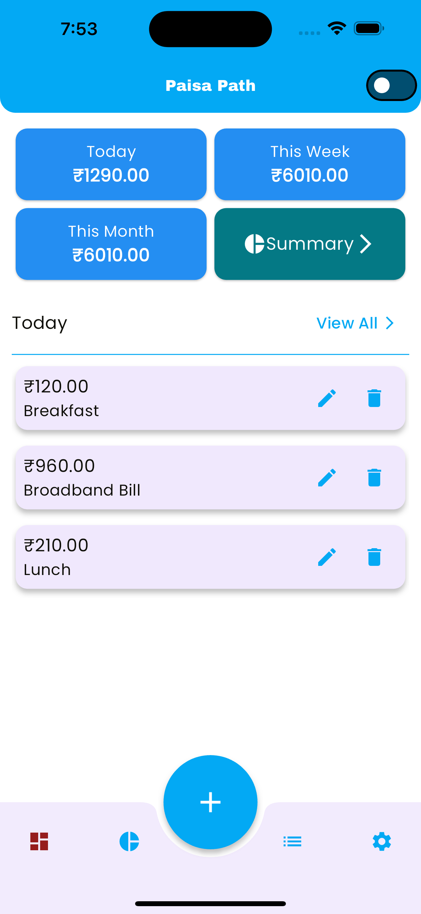
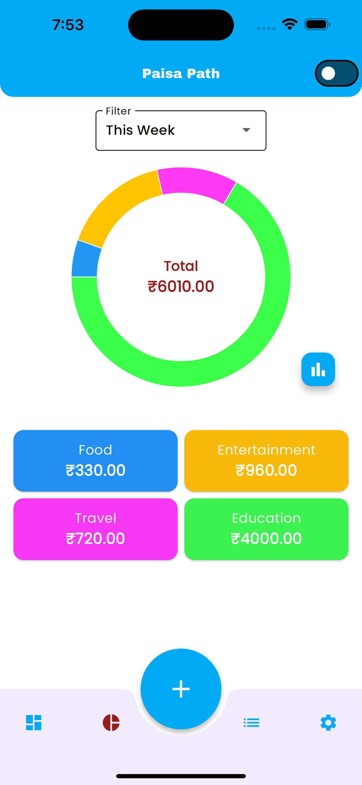
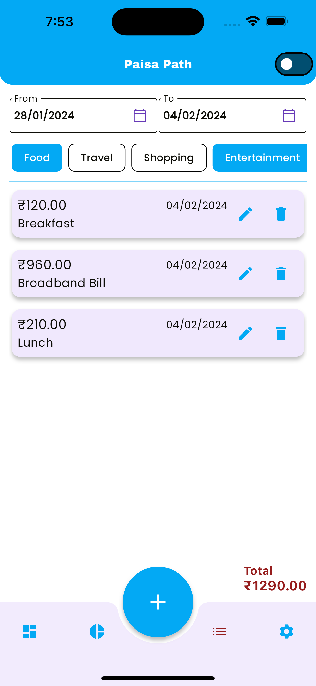
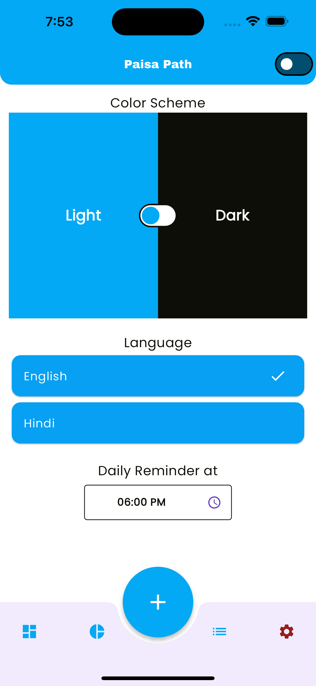
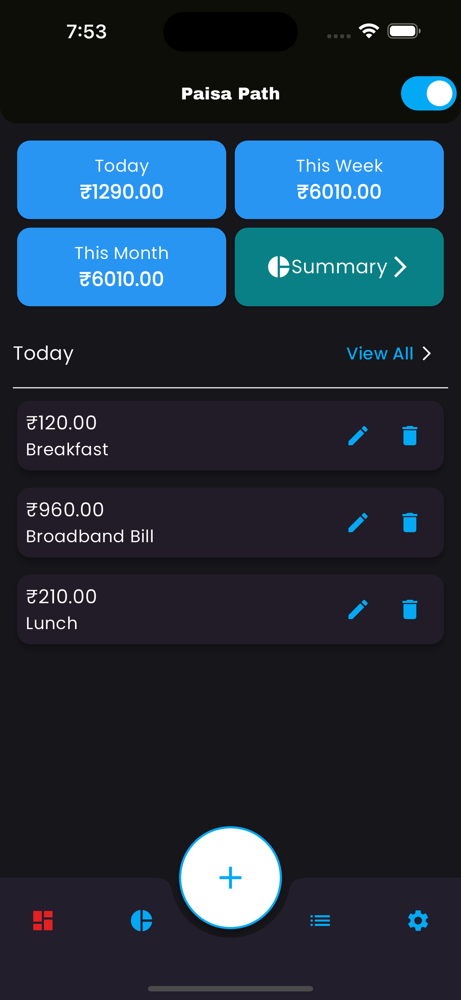
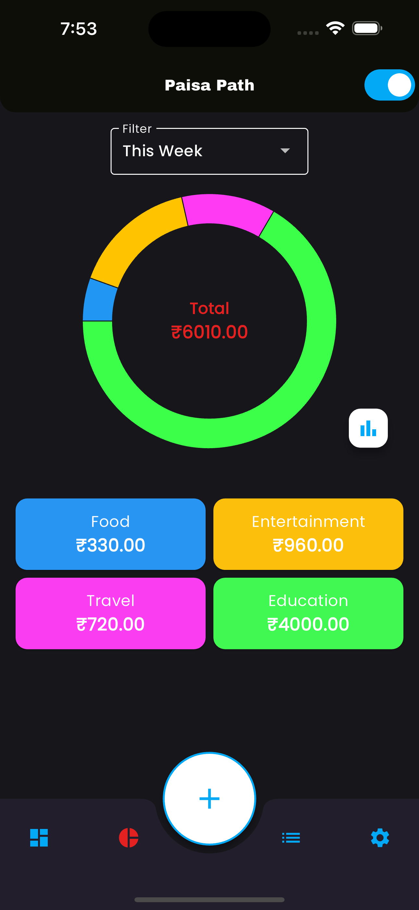
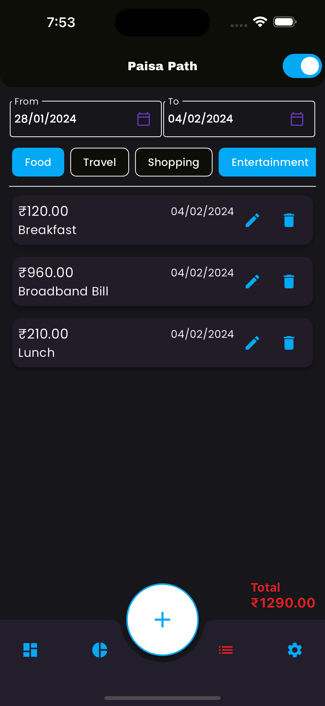
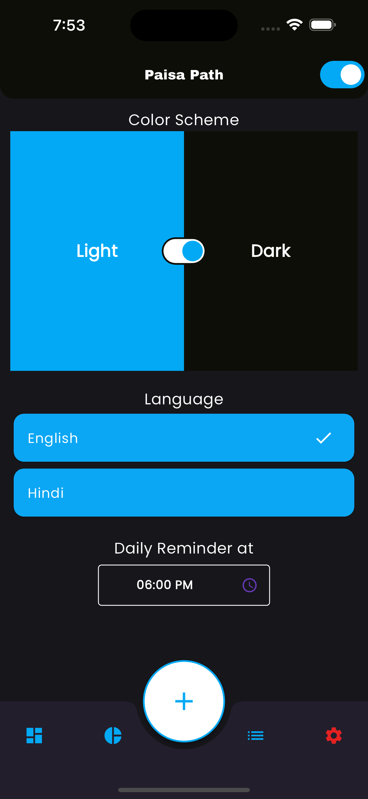

# Paisa Path

This is a Personal Expense Tracker application built using Flutter. The application is designed to help users manage and track their expenses effectively.


## APK Download
Link to the apk file: <a href="https://raw.githubusercontent.com/anees4ever/paisa_path/main/preview/paisa_path.apk" >PaisaPath App</a>

## Video Demo
Link to the video: <a href="https://raw.githubusercontent.com/anees4ever/paisa_path/main/preview/preview.mp4" >Video Link</a>


## Preview
| Theme | | | | |
|---------|---------|---------|---------|---------|
| Light |  |  |  |  |
| Dark |  |  |  |  |


## Project Details
1. State Management: 
    The application uses the GetX package for state management and Dependancy Injection. GetX is a high-performance, lightweight library for Flutter that provides a simple and scalable solution for managing the state of your application.

2. Data Storage: 
    The application uses the Floor package for data persistence. Floor provides a neat SQLite abstraction for your Flutter applications, allowing you to persist your data in a local database with ease.

3. Multi-Language Support: 
    The application supports multiple languages, using custom [Flutter_Lang](https://github.com/anees4ever/flutter_lang.git) package. This package, built in-house, allows the application to be more accessible to users from different regions and enhances the overall user experience. Localization data is located inside ``` assets/languages_data.json ```. The package is under developement, hence no documentation available.

4. Dark / Light Theme: 
    The application supports both Dark and Light themes. Users can switch between these themes based on their preference, providing a more personalized user experience.

5. Expense Categorization: 
    Expenses can be categorized by different types. This feature allows users to organize their expenses more effectively and gain a better understanding of their spending habits.

6. Summary View: 
    The application provides a summary view with Pie and Bar charts, giving users a visual representation of their expenses. Users can filter the charts by different date periods, allowing them to analyze their spending patterns over time.


## Upcoming Features

### 1. Improvement: Clickable Expense Type Tiles:

To enhance the user experience, the expense type tiles on the summary screen will be made clickable. When clicked, the user will be navigated to the expense list page with filters applied accordingly. This will allow users to quickly view the breakup of their expenses based on the selected expense type.

### 2. Feature: Authentication: 

The application will soon support authentication using biometric or FaceID. This feature will provide an additional layer of security and ensure that only authorized users can access the application.


## Setup Instructions

1. Clone the repository
    ```
    git clone https://github.com/anees4ever/paisa_path.git
    ```

2. Navigate to the project directory
    ```
    cd paisa_path
    ```

3. Install dependencies
    ```
    flutter pub get
    dart run build_runner build
    ```

3. Firebase Configurations

    Install [Firebase CLI](https://firebase.google.com/docs/cli) and [flutterfire](https://firebase.google.com/docs/flutter/setup). Then run below command in the terminal.

    ```
    flutterfire configure
    ```

## Running Instructions

Run the below code in the terminal to run the app.

```
flutter run
```

## Additional Information

This application is a work in progress. Future updates will include more features and improvements to enhance the user experience and functionality of the app.


## Contact Information

For any queries, please contact me at [anees4ever@gmail.com](mailto:anees4ever@gmail.com).
